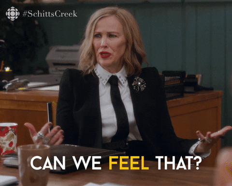
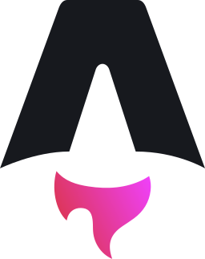

<h1>
  <span class="highlight">Seeing Beyond</span>
  <span class="highlight">the Framework Illusion</span>
</h1>

<div class="title-author">
  Sean C Davis
</div>

---
layout: Setup
---

<h2>
  <span class="highlight pink">
    <span :class="{ 'strike-through': $clicks >= 1 }">
      Why Vue is better than React!
    </span>
  </span>
</h2>

<h2>
  <span class="highlight blue">
    <span :class="{ 'strike-through': $clicks >= 1 }">
      You should migrate from Next
    </span>
  </span>
  <span class="highlight blue">
    <span :class="{ 'strike-through': $clicks >= 1 }">
      to TanStack immediately!
    </span>
  </span>
</h2>

<h2>
  <span class="highlight lime">
    <span :class="{ 'strike-through': $clicks >= 1 && $clicks < 2 }">
      11ty is a full-stack framework!
    </span>
  </span>
</h2>

<h2>
  <span class="highlight">
    <span :class="{ 'strike-through': $clicks >= 1 }">
      Astro is the best choice
    </span>
  </span>
  <span class="highlight">
    <span :class="{ 'strike-through': $clicks >= 1 }">
      for enterprises!
    </span>
  </span>
</h2>

<div v-click="1" style="display: none;"></div>
<div v-click="2" style="display: none;"></div>

<!--
- This is not “how to choose a framework”
- You've already done that. You have your opinions
- These are factual statements btw
- This is about your long-term relationship with your framework
- If you've fallen out of love with your framework, I will help you find that spark again
- If you love your framework, I'll help you understand why
- But then I'll tear that all down, because things are changing, and the way we think about frameworks needs to change, too.
- Okay, so maybe it is a little bit about how to choose a framework
- Also, kind of a little about 11ty
 -->

---
layout: SCDIntro
---

# Sean C Davis

::title::

Developer Education, Netlify

::image::


::links::

<div class="intro-link">
  
  <span>@seancdavis</span>
</div>

<div class="intro-link">
  
  
  <span>@seancdavis.com</span>
</div>

<div class="intro-link">
  
  
  <span>@seancdavis29</span>
</div>

---
layout: statement
color: shapes
---

# How do we choose a framework?

---
layout: ContainedGif
backgroundSize: contain
---



<!--
- We choose based on FEELINGS!
- This can be influenced by brand and community
- But also plays into developer experience
 -->

---
layout: statement
color: blue
---

# Developer Experience (DX)

---
layout: statement
color: blue
---

<h1>
  Good DX means
  <span v-mark.circle.white="1">shipping faster</span>
  from Day 1 to
  <span v-mark.white="2">Day 1,000</span>.
</h1>

<!--
1. How fast can you ship an MVP?
2. DX affects the cost of maintaining the application over time.
- After that, how fast you can deliver features is a product of your engineering practices.
 -->

---
layout: statement
color: green
---

<h1>
  A framework's value comes from the
  <span v-mark.circle.white="1">engineering practices</span>
  applied to its DX.
</h1>

---
layout: ContainedGif
backgroundSize: contain
---


---
layout: statement
color: lime
---

# User Experience (UX)

---
layout: statement
color: lime
---

# Users don't care about your framework choice.

<v-click>

# They want to get things done.

</v-click>

<v-click>

<h1 style="font-size: 6rem;">FAST!</h1>

</v-click>

<!--
And if you optimize that ...
 -->

---
layout: statement
color: shapes
---

<h1 style="font-size: 3rem;">Most frameworks are really good.</h1>

<v-click>

<h1>
  <span class="highlight">All frameworks have tradeoffs.</span>
</h1>

</v-click>

<!--
- If you’re building a single‑page application or a single‑page application framework, your optimization patterns will look a lot different.

- We adapt our behavior and our justification after the choice.
- I’m not discrediting the thinking.
- The reality is it works because you pick a [Next/Nuxt/whatever]; they’re all really well designed.
 -->

---
layout: statement
color: shapes
---

# What does your framework do for your users in production?

<!--
- Where the framework disappears... ?
- This one is more about how when you serve HTML that's what the user gets.
- This is the question I asked myself, because ...

- Pick on Astro because I have only one problem with Astro and this is not it.
 -->

---
layout: CodeComparison
---

# Example: Astro Dev vs Prod

::left::

<v-click>

## Development

```astro
---
import Welcome from "../components/Welcome.astro";
import Layout from "../layouts/Layout.astro";
---

<Layout>
  <Welcome />
</Layout>
```

</v-click>

::right::

<v-click>

## Production

```html
<!DOCTYPE html>
<html lang="en" data-astro-cid-sckkx6r4>
  <head>
    <meta charset="UTF-8" />
    <meta name="viewport" content="width=device-width" />
    <link rel="icon" type="image/svg+xml" href="/favicon.svg" />
    <meta name="generator" content="Astro v5.13.7" />
    <title>Astro Basics</title>
    <style>
      /* ... */
    </style>
  </head>
  <body data-astro-cid-sckkx6r4>
    <div id="container" data-astro-cid-mmc7otgs>
      <!-- ... -->
    </div>
  </body>
</html>
```

</v-click>

---
layout: ContainedGif
backgroundSize: contain
---


<!-- # The framework disappears! -->

---
layout: Drawing
---

# Example: Astro Build Process (simplified)

::drawing::

<Excalidraw drawFilePath="./drawings/astro-build-process.excalidraw.json" />

---
layout: CodeComparison
---

# Example: Rails Dev vs Prod


::left::

<v-click>

## Development

```ruby
class UsersController < ApplicationController
  authenticate! :user, except: %i[accept_invitation complete_invitation]
  set! :user, only: %i[show edit update destroy]

  def index
    @users = User.all.includes(:company)
    @companies = Company.by_name
    params[:sort] ||= { by: :last_name, type: :alpha, in: :asc }
    @users = sort_collection(@users)
    @users = Kaminari.paginate_array(@users).page(params[:page] || 1)
  end
end
```

</v-click>

::right::

<v-click>

## Production

```ruby
class UsersController < ApplicationController
  authenticate! :user, except: %i[accept_invitation complete_invitation]
  set! :user, only: %i[show edit update destroy]

  def index
    @users = User.all.includes(:company)
    @companies = Company.by_name
    params[:sort] ||= { by: :last_name, type: :alpha, in: :asc }
    @users = sort_collection(@users)
    @users = Kaminari.paginate_array(@users).page(params[:page] || 1)
  end
end
```

</v-click>

<!-- It gets more complex when you add in SSR -->

---
layout: CodeExample
---

# Example: SSR with Astro on Netlify

<v-click>

```ts
import netlify from "@astrojs/netlify";
import { defineConfig } from "astro/config";

export default defineConfig({
  output: "server",
  adapter: netlify(),
});
```

</v-click>

---

# TODO

# SSR in JavaScript frameworks

Diagram of SSR build process

<!--
- I’m going to deploy to Netlify because I’ve got my adapter and my Netlify plugin.
- That’s all you need as a developer; you need this Netlify plugin.
- “All the Netlify server‑side rendered stuff,” right? Yeah, no, not really.
- What’s hysterical: the technology we use to render server‑side rendered pages in Astro is called servers [serverless/“Servers”].
 -->

---
layout: statement
color: pink
---

<h1>
  A platform adapter hooks into a framework's build process to transform
  <span v-mark.circle.black="1">framework features</span>
  into
  <span v-mark.circle.black="2">platform primitives</span>
</h1>

<!--
# Isn't it an Astro site?
Yes. No. Sort of. (IT's a spectrum)
 -->

---
layout: statement
color: shapes
---

<h1>
  <span class="highlight pink">
    Every framework is only
  </span>
  <span class="highlight pink">
    as powerful as
  </span>
  <span class="highlight pink">
    the platform it runs on.
  </span>
</h1>

---
layout: LogoGrid
---

# All these frameworks have the

# same set of capabilities on Netlify:

::logos::





<!--
How they are implemented in development varies.

TODO: Framework logos
-->

---
layout: statement
color: shapes
---

# Demo time!

<!--
1. Show the UIs
2. package.json
3. Example of authentication
 -->

---
layout: statement
color: blue
---

# Platform integration is what matters most for a framework.

<!--
Do you need a framework? Probably. But you need one that plays well with the platform.
 -->

---
layout: image
image: ./images/ax-blog-post.png
---

<!-- # Agent experience -->


<!--
What is really going to matter in the future.

The DX <> AX parallel
 -->

---
layout: statement
color: blue
---

<h1 style="font-size: 3.5rem;">
  Agent experience matters because DX and UX are directly impacted by the quality of solutions an agent can implement.
</h1>

<!-- (And Why I love Astro) -->

---
layout: statement
color: shapes
---

<!-- This is where to check for the bolt output if I did that -->

<v-click>

<h1>
  <span class="highlight lime">Pick what works for you.</span>
</h1>

</v-click>

<v-click>

<h1>
  <span class="highlight lime">We're all different.</span>
</h1>

</v-click>

---
layout: statement
color: shapes
---

<h1 style="font-size: 2rem; font-style: italic;">
  And ...
</h1>

<v-click>

<h1>
  <span class="highlight lime">
    Don't forget to have
  </span>
  <span class="highlight lime">
    a little fun along the way!
  </span>
</h1>

</v-click>

